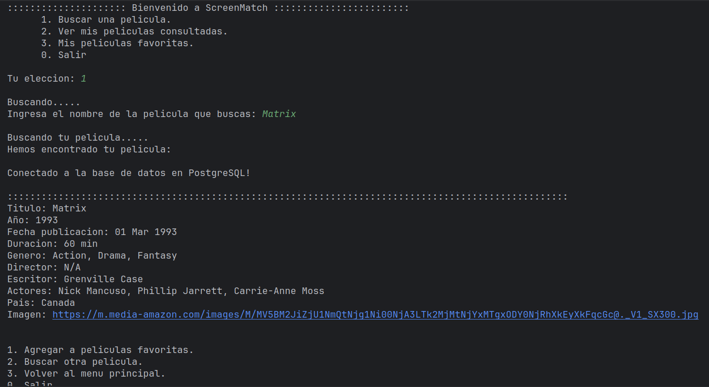
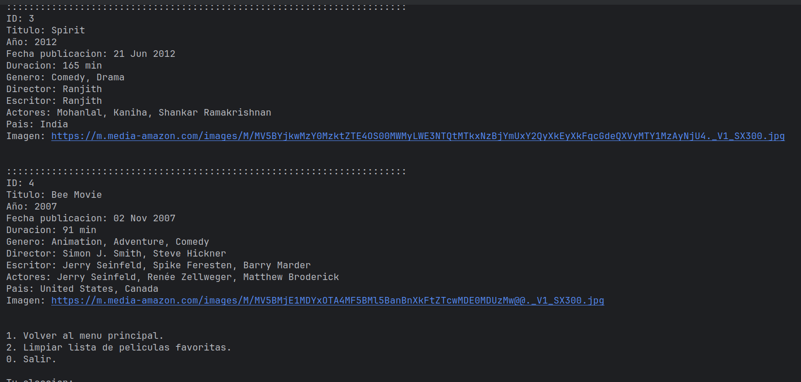
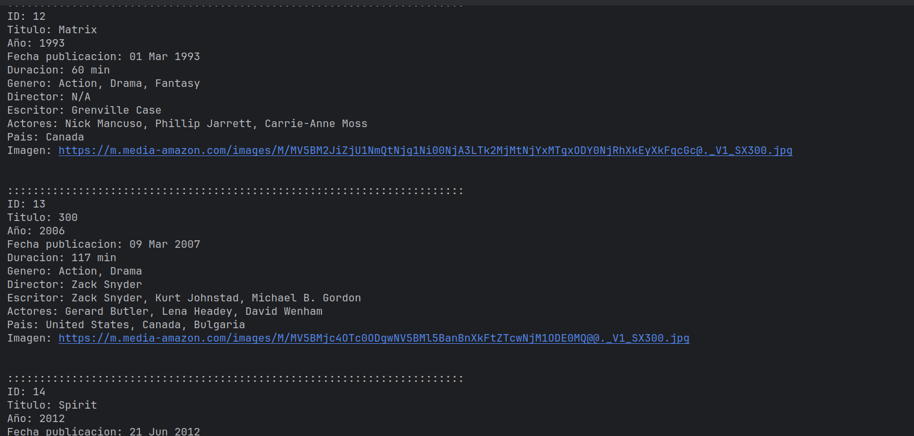

# API Gestor de Peliculas 🎥

### Descripcion:
Este sistema permite la búsqueda y gestión de películas a través de la API 
de OMDb (https://www.omdbapi.com/). Forma parte de la especialización en 
desarrollo backend con Java del programa ONE (Oracle Next Education).

El sistema permite buscar múltiples títulos disponibles en la API y acceder
a la información detallada de cada película. Además, ofrece la opción de 
agregar películas a una lista de favoritos, la cual se almacena en una base
de datos diseñada en PostgreSQL. Los usuarios pueden modificar esta lista
desde el menú del sistema.

La base de datos también guarda un registro de todas las consultas 
realizadas. Como funcionalidad adicional, el sistema genera un archivo .txt
que contiene las películas consultadas en formato JSON, facilitando su 
envio a otras personas.

- Peliculas favoritas:

- Peliculas consultadas:
  

- Archivo generado .txt con las peliculas consultadas:
  

### Objetivos del proyecto:
1. Poner en practica los conocimientos adquiridos en la primera formacion
   del programa ONE sobre desarrollo backend con Java.  

2. Crear un proyecto a partir de lo aprendido.  

3. Hacer consumo de una API y utilizar los datos obtenidos en una aplicacion 
   desarrollada en Java.  

4. Trabajar con librerias externas y hacer uso de Maven como gestor de 
   dependencias para Java.  

5. Trabajar con datos en formato JSON haciendo uso de la libreria Gson y 
   convertirlos en objetos soportados en Java, para posteriormente enviarlos
   a una base de datos en PostgreSQL.  

6. Conocer mejor el protocolo HTTP y sus metodos(GET - POST - PUT - DELETE).

- Estructura del proyecto:
  

### Tecnologias utilizadas:
1. Java JDK 21 corretto 21.0.4 como lenguaje de programacion.
2. Maven como gestor de dependencias.
3. Librerias Externas (OkHttp - Gson - conector postgresql 42.7.2).
4. Postman para realizar pruebas.
5. PostsgreSQL como motor de base de datos.
6. IntelliJ-Idea como IDE.
7. API de OMDb para obtener datos (https://www.omdbapi.com/).